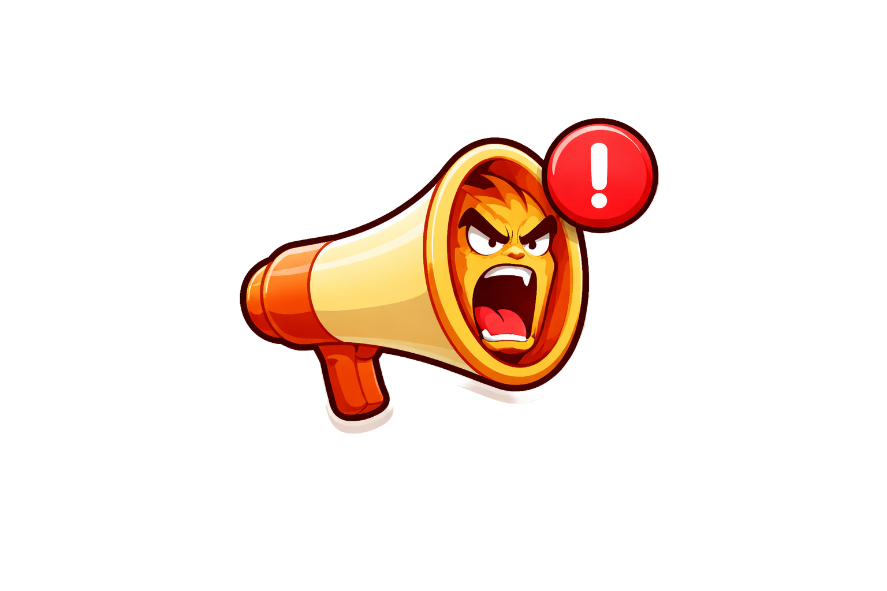

<!-- PROJECT SHIELDS -->

[![Contributors][contributors-shield]][contributors-url]
[![Forks][forks-shield]][forks-url]
[![Stargazers][stars-shield]][stars-url]
[![Issues][issues-shield]][issues-url]
[![Unlicense License][license-shield]][license-url]
[![LinkedIn][linkedin-shield]][linkedin-url]

<!-- PROJECT LOGO -->
<br />
<div align="center">
  <a href="https://github.com/AntonioIonica/yellatme">
    
  </a>

<h3 align="center">YellAtMe</h3>

  <p align="center">
    Subscription management app where user add his subscriptions with it's renewal dates and the app sends emails before the date; optimal dashboard where the user sees how much money he spent
    <br />
    <a href="https://github.com/AntonioIonica/yellatme"><strong>Explore the docs »</strong></a>
    <br />
    <br />
    <a href="https://github.com/AntonioIonica/yellatme">View Demo</a>
    &middot;
    <a href="https://github.com/AntonioIonica/yellatme/issues/new?labels=bug&template=bug-report---.md">Report Bug</a>
    &middot;
    <a href="https://github.com/AntonioIonica/yellatme/issues/new?labels=enhancement&template=feature-request---.md">Request Feature</a>
  </p>
</div>


<!-- TABLE OF CONTENTS -->
<details>
  <summary>Table of Contents</summary>
  <ol>
    <li>
      <a href="#about-the-project">About The Project</a>
      <ul>
        <li><a href="#built-with">Built With</a></li>
      </ul>
    </li>
    <li>
      <a href="#getting-started">Getting Started</a>
      <ul>
        <li><a href="#prerequisites">Prerequisites</a></li>
        <li><a href="#installation">Installation</a></li>
      </ul>
    </li>
    <li><a href="#usage">Usage</a></li>
    <li><a href="#roadmap">Roadmap</a></li>
    <li><a href="#contributing">Contributing</a></li>
    <li><a href="#license">License</a></li>
    <li><a href="#contact">Contact</a></li>
    <li><a href="#acknowledgments">Acknowledgments</a></li>
  </ol>
</details>


<!-- ABOUT THE PROJECT -->
## About The Project

[![Product Name Screen Shot][product-screenshot]](-)

Subscription management application where users gets reminder emails before the renewal date of his subscriptions (eg. Netflix) as he can cancel them. The dashboard acts as a subscription and paying wall as he can add other types of reminders and see how much money he spent on subscriptions.

Key features:
  - adding subscriptions by categories
  - choosing when to get emails by day
  - calendar to see the renewals by day
  - dashboard to see the spending by year, month, day and projection

Topics I learned by building the app: 
  - authentication and authorization using jwt token
  - state management using Zustand
  - data visualization using Recharts
  - React hot toast
  - testing using Vitest
  - Stripe integration

<p align="right">(<a href="#readme-top">back to top</a>)</p>


### Built With

* React [![React][react.dev]][React-url]
* Supabase [![Supabase][supabase.com]][Supabase-url]
* Recharts [[Recharts-url]]
* Styled components [![Styled components][styled-components.com]][Styled Components-url]
* Vite [![Vite][vite.dev]][Vite-url]

<p align="right">(<a href="#readme-top">back to top</a>)</p>


<!-- GETTING STARTED -->
## Getting Started

This is an example of how you may give instructions on setting up your project locally.
To get a local copy up and running follow these simple example steps.

### Prerequisites


* npm
  ```sh
  npm install npm@latest -g
  ```

### Installation

1. Clone the repo
   ```sh
   git clone https://github.com/AntonioIonica/yellatme
   ```
2. Install NPM packages
   ```sh
   npm install
   ```
3. Change git remote url to avoid accidental pushes to base project
   ```sh
   git remote set-url origin github_username/repo_name
   git remote -v # confirm the changes
   ```
4. Start the project
   ``` sh
   npm run start
   ```

<p align="right">(<a href="#readme-top">back to top</a>)</p>


<!-- USAGE EXAMPLES -->
## Usage

This project goal is to master the mentioned technologies as the code is intellectual property of Schmedtmann


<p align="right">(<a href="#readme-top">back to top</a>)</p>


<!-- ROADMAP -->
## Roadmap

- [x] populated cabins


See the [open issues](https://github.com/AntonioIonica/yellatme) for a full list of proposed features (and known issues).

<p align="right">(<a href="#readme-top">back to top</a>)</p>


<!-- CONTRIBUTING -->
## Contributing

Contributions are what make the open source community such an amazing place to learn, inspire, and create. Any contributions you make are **greatly appreciated**.

If you have a suggestion that would make this better, please fork the repo and create a pull request. You can also simply open an issue with the tag "enhancement".
Don't forget to give the project a star! Thanks again!

1. Fork the Project
2. Create your Feature Branch (`git checkout -b feature/AmazingFeature`)
3. Commit your Changes (`git commit -m 'Add some AmazingFeature'`)
4. Push to the Branch (`git push origin feature/AmazingFeature`)
5. Open a Pull Request

<p align="right">(<a href="#readme-top">back to top</a>)</p>

### Top contributors:

-

<!-- LICENSE -->
## License

Distributed under the project_license. See `LICENSE.txt` for more information.

<p align="right">(<a href="#readme-top">back to top</a>)</p>


<!-- CONTACT -->
## Contact

Your Name - [@X](https://twitter.com/AntonioIonica) - antonioionica@gmail.com

Project Link: [Github](https://github.com/AntonioIonica/yellatme)

<p align="right">(<a href="#readme-top">back to top</a>)</p>


<!-- MARKDOWN LINKS & IMAGES -->
<!-- https://www.markdownguide.org/basic-syntax/#reference-style-links -->
[contributors-shield]: https://img.shields.io/github/contributors/AntonioIonica/yellatme.svg?style=for-the-badge
[contributors-url]: https://github.com/AntonioIonica/yellatme/graphs/contributors
[forks-shield]: https://img.shields.io/github/forks/AntonioIonica/yellatme.svg?style=for-the-badge
[forks-url]: https://github.com/AntonioIonica/yellatme/network/members
[stars-shield]: https://img.shields.io/github/stars/AntonioIonica/yellatme.svg?style=for-the-badge
[stars-url]: https://github.com/AntonioIonica/yellatme/stargazers
[issues-shield]: https://img.shields.io/github/issues/AntonioIonica/yellatme.svg?style=for-the-badge
[issues-url]: https://github.com/AntonioIonica/forkify-restaurant-boilerplate/issues
[license-shield]: https://img.shields.io/github/license/AntonioIonica/yellatme.svg?style=for-the-badge
[license-url]: https://github.com/AntonioIonica/yellatme/blob/master/LICENSE.txt
[linkedin-shield]: https://img.shields.io/badge/-LinkedIn-black.svg?style=for-the-badge&logo=linkedin&colorB=555
[linkedin-url]: https://linkedin.com/in/antonio-iulian-ionica-478074353/
[product-screenshot]: ./public/project_screenshot.png
<!-- Shields.io badges. You can a comprehensive list with many more badges at: https://github.com/inttter/md-badges -->
[react.dev]: https://img.shields.io/badge/React-%2320232a.svg?logo=react&logoColor=%2361DAFB
[React-url]: https://react.dev 
[supabase.com]: https://img.shields.io/badge/Supabase-3FCF8E?logo=supabase&logoColor=fff
[Supabase-url]: https://supabase.com
[Recharts-url]: https://recharts.github.io
[styled-components.com]: https://img.shields.io/badge/styled--components-DB7093?logo=styledcomponents&logoColor=fff
[Styled Components-url]: https://styled-components.com
[vite.dev]: https://img.shields.io/badge/Vite-646CFF?logo=vite&logoColor=fff
[Vite-url]: https://vite.dev